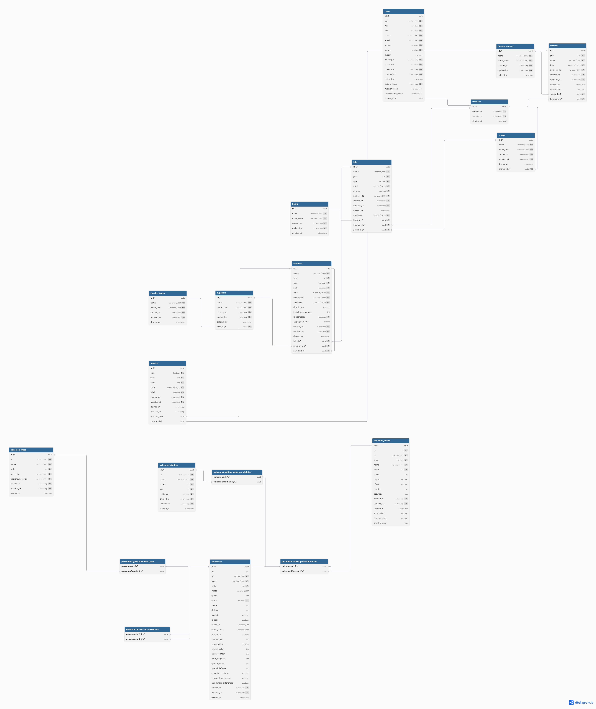

# 🗄️ Modelo de Dados – MACHADOFOLIO
Este repositório contém a modelagem do banco de dados do projeto, incluindo tabelas financeiras, usuários e dados de Pokémon para fins de estudo e demonstração. O diagrama foi construído usando **DBML** e pode ser visualizado de forma interativa no [dbdiagram.io](https://dbdiagram.io/d/68dab323d2b621e42270472d).

---
## 📚 Visão Geral
O banco de dados foi estruturado com foco em:

- **UUIDs** como identificadores únicos de todas as tabelas.
- **Relacionamentos claros**, incluindo muitos-para-muitos e auto-relacionamentos.
- **Auditoria básica**, com campos `created_at`, `updated_at` e `deleted_at`.
- **Tabelas financeiras**, incluindo `finances`, `banks`, `bills`, `expenses`, `incomes` e `groups`.
- **Tabelas de usuários** para controle de cadastro, autenticação e perfis.
- **Tabelas Pokémon**, incluindo habilidades, tipos, movimentos e evolução.

---

## 📝 Tabelas Principais 

### Finanças
- `finances`: Tabela principal de finanças.
- `banks`: Bancos cadastrados.
- `groups`: Grupos financeiros vinculados a finanças.
- `bills`: Contas vinculadas a bancos, grupos e finanças.
- `expenses`: Gastos vinculados a contas e fornecedores.
- `incomes`: Receitas vinculadas a fontes de renda e finanças.
- `months`: Controle mensal de pagamentos e recebimentos.

### Usuários
- `users`: Informações de cadastro, autenticação, perfil e vínculo com finanças.

### Pokémon
- `pokemons`: Informações gerais de cada Pokémon.
- `pokemon_abilities`: Habilidades de Pokémon.
- `pokemon_moves`: Movimentos de Pokémon.
- `pokemon_types`: Tipos de Pokémon.
- `pokemons_moves_pokemon_moves`: Relacionamento muitos-para-muitos entre Pokémons e seus movimentos.
- `pokemons_types_pokemon_types`: Relacionamento muitos-para-muitos entre Pokémons e tipos.
- `pokemons_abilities_pokemon_abilities`: Relacionamento muitos-para-muitos entre Pokémons e habilidades.
- `pokemons_evolutions_pokemons`: Relacionamento auto-referenciado para evoluções de Pokémons.

---

## Relacionamentos Principais

- **Usuário ↔ Finanças**: Cada usuário pode estar vinculado a uma única finança (`finance_id`).
- **Grupo ↔ Finanças**: Cada grupo pertence a uma finança (`finance_id`).
- **Bills ↔ Banks, Groups, Finances**: Contas vinculadas a banco, grupo e finança.
- **Expenses ↔ Bills, Suppliers**: Gastos vinculados a contas e fornecedores.
- **Incomes ↔ Income Sources, Finances**: Receitas vinculadas a fonte e finança.
- **Pokemons ↔ Moves, Types, Abilities**: Relacionamentos muitos-para-muitos através de tabelas de associação.
- **Pokemons ↔ Pokemons (Evolutions)**: Auto-relacionamento representando evoluções de Pokémons.

---

## Convenções

- Todos os **IDs** são do tipo `UUID`.
- Campos `created_at`, `updated_at` e `deleted_at` são usados para **auditoria**.
- Campos `name_code` são usados para **referências consistentes** internas.
- Campos booleanos (`paid`, `all_paid`, `is_aggregate`) controlam status de registros.
- Campos com enum (`role`, `status`, `type`) representam **valores restritos**.

---

## Link Interativo

Você pode visualizar o diagrama completo de forma interativa e navegar pelos relacionamentos diretamente no dbdiagram.io:

---

## Como Utilizar

1. **Visualização rápida**: Use o link do dbdiagram.io para ver a estrutura completa.
2. **Geração de scripts SQL**: A partir do DBML, é possível gerar scripts para PostgreSQL, MySQL ou SQLite.
3. **Atualizações**: Mantenha o DBML atualizado sempre que novas tabelas ou campos forem adicionados.

---

## Autor

- Desenvolvedor: Jorge Luiz Vieira Machado
- Contato: jorge.vmachado@gmail.com

---

## Referências

- [DBML Documentation](https://dbml.dbdiagram.io/docs)

## 📊 Diagrama
